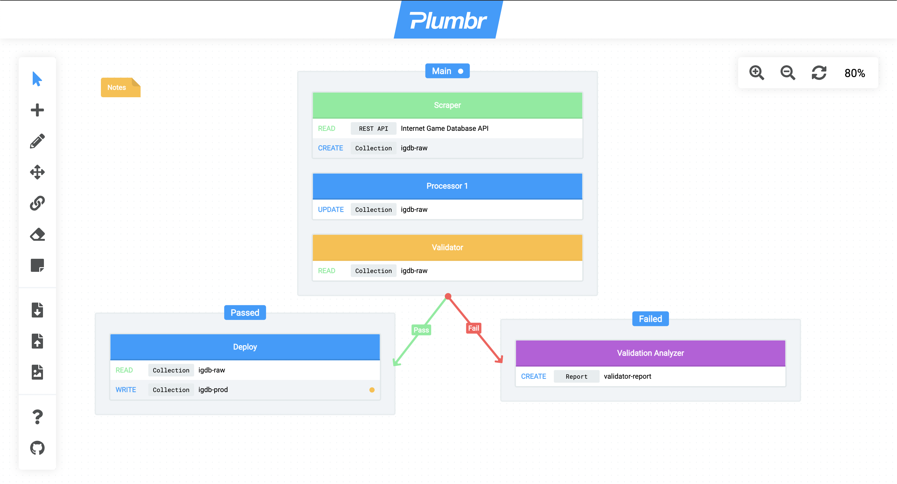

# What is Plumbr?

Plumbr is used for visualizing the data flow within data pipelines when working with [Chisel data integration framework](https://chiselpowered.com).

## Tools

The following tools are available in the top section of the toolbar:
  - **Select tool**: Allows selecting components (multi-select is allowed only for the components of the **same type**) and viewing component description by double-clicking on a component. While equipped, the following shortcuts become available:
    - `shift+n`: Inserts a new component inside a single selected element or the canvas.
    - `delete`, `backspace`: Deletes the selected elements.
    - `shift+t`: Edits a single selected element.
    - `shift+c`: Copies the selected elements.
    - `shift+v`: Pastes the copied/cut elements into the selected elements or the canvas.
    - `shift+x`: Cuts the selected elements.
    - `shift+d`: Duplicates the selected elements within their own parent component.
    - `shift+arrow`: Moves a single selected element.
  - **Insert tool**: Allows inserting new components on the canvas or within other components when clicked.
  - **Edit tool**: Allows editing components when clicked.
  - **Move tool**: Allows moving components when dragged.
  - **Link tool**: Allows linking pipelines and changing links color.
  - **Erase tool**: Allows deleting components and links when clicked.
  - **Note tool**: Allows inserting notes on the canvas and changing notes color.

The following functions are available in the mid section of the toolbar:
  - **Open project**: Opens a Plumbr project (`.flow` files).
  - **Save project**: Saves the current project on disk as a `.flow` file.
  - **Export as image**: Exports the current project as a `.png` image.

The following informative functions are available in the bottom section of the toolbar:
  - **Help**: Displays help.
  - **View source**: Opens the Github repository of Plumbr.

## Zoom Bar

The zoom bar is located on the top right corner of the screen, displaying the current zoom level. When hovered, the zoom bar extends with three buttons to control zooming on the canvas.

## Global Shortcuts

The following shortcuts are available globally regardless of the equipped tool:
  - `s`: Equips the select tool.
  - `n`: Equips the insert tool.
  - `t`: Equips the edit tool.
  - `m`: Equips the move tool.
  - `l`: Equips the link tool.
  - `e`: Equips the erase tool.
  - `o`: Equips the note tool.
  - `shift+o`: Opens a Plumbr project (`.flow` files).
  - `shift+s`: Saves the current project on disk as a `.flow` file.
  - `shift+e`: Exports the current project as a `.png` image.
  - `shift+h`: Displays help.
  - `shift+z`: Undoes the last action (up to 15 actions).
  - `shift+r`: Resets canvas position to the start position.
  - `shift+wheel`: Zooms in and out on the canvas.
  - `space`: Enables dragging the canvas when held down.
  - `shift+minus`: Zooms out on the canvas.
  - `shift+plus`: Zooms in on the canvas.
  - `shift+0`: Resets zoom to 100%.

## Markdown Support

All descriptions of pipelines, modules, module fields, and notes support Github-flavored Markdown.

## Text Highlighting

The names of module fields support text highlighting using the mustache syntax (e.g. `{{text}}` where `text` is a highlighted text). This simply changes the style of the text inside the curly brackets, making it highlighted.

## Auto-save

All work will be automatically saved into the browser to avoid losing unsaved changes when the browser is closed for any reason. Though, it is good practice to always save your work on disk when a lot has changed since the last manual save.

# Updating App Version

Using the command `npm run update-version -- VERSION` (where `VERSION` is the new version) will update `appData` in `ngsw-config.json` and the `package.json` files. This is important since the service worker config must be updated in order for the app to show update notifications.
